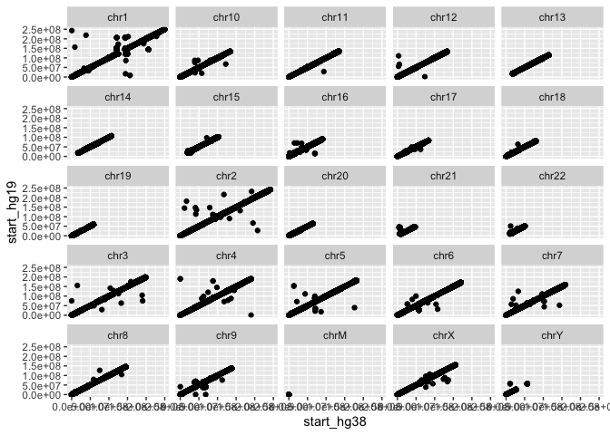
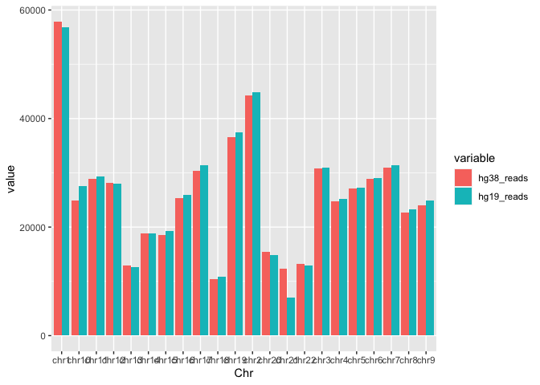
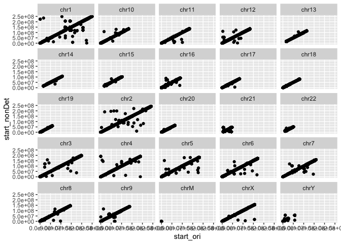

Assignment 4: Mappability continues
================

- <a href="#assignment-overview" id="toc-assignment-overview">Assignment
  Overview</a>
- <a href="#important-remarks" id="toc-important-remarks">Important
  remarks</a>
  - <a href="#0-getting-ready" id="toc-0-getting-ready">0. Getting ready</a>
  - <a href="#1-differences-between-genome-builds"
    id="toc-1-differences-between-genome-builds">1. Differences between
    genome builds</a>
    - <a href="#a-se-alignment-against-hg38-and-hg19"
      id="toc-a-se-alignment-against-hg38-and-hg19">a. SE alignment against
      hg38 and hg19</a>
    - <a href="#b-making-the-files-comparable"
      id="toc-b-making-the-files-comparable">b. Making the files
      comparable</a>
    - <a href="#c-analyzing-the-differences"
      id="toc-c-analyzing-the-differences">c. Analyzing the differences</a>
    - <a href="#d-reads-per-chromosome"
      id="toc-d-reads-per-chromosome">d. Reads per chromosome</a>
    - <a href="#d-reads-position-in-the-genome-builds"
      id="toc-d-reads-position-in-the-genome-builds">d. Reads position in the
      genome builds</a>
  - <a href="#2-ambiguity-in-reads-mapping"
    id="toc-2-ambiguity-in-reads-mapping">2. Ambiguity in reads mapping</a>
    - <a href="#a-redoing-the-hg38-alignment"
      id="toc-a-redoing-the-hg38-alignment">a. Redoing the hg38 alignment</a>
    - <a href="#b-analyzing-the-ambiguity"
      id="toc-b-analyzing-the-ambiguity">b. Analyzing the ambiguity</a>
    - <a href="#c-non-deterministic-seeds"
      id="toc-c-non-deterministic-seeds">c. Non-deterministic seeds</a>
    - <a href="#d-analyzing-the-changes"
      id="toc-d-analyzing-the-changes">d. Analyzing the changes</a>
- <a href="#authors-and-contributions"
  id="toc-authors-and-contributions">Authors and contributions</a>

# Assignment Overview

The goal of this assignment is to get you acquainted with how the
different ways to analyze a file can change the results of the reads’
alignment against the reference genome. We will be using only one file:
**SRR12506919_subset.fastq.gz**, that can be found under the following
path: **/projects/bmeg/A4/**. It will be divided into two parts:

Part 1: Analyzing different genome builds

Part 2: Ambiguity in reads mapping

# Important remarks

- Remember to be as clear as possible with your answers.

- Please make sure to explain your thought process behind your code and
  answers.

- If you have used methods suggested on forums, websites, make sure to
  cite them.

- If you have not been able to find the answer to a random bug with
  reasonable effort, please ask on Piazza! We are here to help, the
  assignments should be a safe environment for you to try new things and
  learn.

## 0. Getting ready

As always, before we get started we will install the tools required for
the assignment. This time, we only need to add:

- LiftOver (<https://genome.sph.umich.edu/wiki/LiftOver>). These is a
  package designed to change files from a specific coordinates system
  (i.e., genome build) to another.

- bedtools (<https://bedtools.readthedocs.io/en/latest/>). It’s a
  powerful tool to compare genomic positions.

``` bash

#?# Add liftOver to your conda environment created on A1, type the command you used below - 1 pt
conda install -c bioconda ucsc-liftover

#?# Add bedtools to your conda environment created on A1, type the command you used below - 1 pt
conda install -c bioconda bedtools
```

## 1. Differences between genome builds

Your Professor informs you that the Information and Technology (IT)
department was able to recover part of your data from the server.
Unfortunately, they were not able to recover your pipelines or scripts.
Since you were using a pre-made index of the reference genome, you don’t
remember which genome build was used to map your sequences (hg19 or
hg38). You cannot decide if it would be a big deal to use different
genome builds for different alignments, at the end you could just make
sure they are in the same genome build when you compare them, right?
Thus, you decide to investigate if it would make a lot of difference to
use a different version to assess what varies when you align the same
reads to different genome-builds.

### a. SE alignment against hg38 and hg19

``` bash

## Pre-made indexes can be found here: 
## hg19 index: /projects/bmeg/indexes/hg19_bowtie2_index
## hg38 index: /projects/bmeg/indexes/hg38_bowtie2_index
## Recall that this is the fastq to be used throughout: /projects/bmeg/A4/SRR12506919_subset.fastq.gz

#?# Perform a single-end alignment using bowtie2 against the pre-made index of the hg38 genome build - 2 pt

bowtie2 -x /projects/bmeg/indexes/hg38/hg38_bowtie2_index -U /projects/bmeg/A4/SRR12506919_subset.fastq.gz -S SRR12506919_subset_hg38_aligned.sam

#?# Perform a single-end alignment using bowtie2 against the pre-made index of the hg19 genome build - 2 pt

bowtie2 -x /projects/bmeg/indexes/hg19/hg19_bowtie2_index -U /projects/bmeg/A4/SRR12506919_subset.fastq.gz -S SRR12506919_subset_hg19_aligned.sam
```

### b. Making the files comparable

Before you can start comparing the files, you realize you need to
translate them to the same genomic coordinate system. If you don’t do
this and try to find mismatches between the files you will find a ton,
but that wouldn’t mean that the reads are mapping to different parts of
the genome, just that the coordinates are different (e.g. if there is a
1 bp insertion in hg38 relative to hg19, every base after that insertion
will have different coordinates). Hence, you go ahead and use your
favorite genome build: hg38. To translate hg19 to hg38, we need to do a
couple of steps:

- Sam to Bam: Convert the alignment file (sam) to binary format (bam),
  this will facilitate the manipulation of the files and will decrease
  the disk space used substantially.

- Bam to bed: Convert the bam alignment file to bed format, enabling the
  comparison of the genomic positions where the reads mapped.

- Change genomic coordinates: Use liftOver to change the alignment file
  made using the hg19 index to the hg38 coordinates of the genome.

``` bash

## Sam to Bam -------------
#?# Convert the SE alignment performed against hg19  (hg19 alignment) to bam, type the command you used below -1 pt

samtools view -h -b -o SRR12506919_subset_hg19_aligned.bam SRR12506919_subset_hg19_aligned.sam

#?# Convert the SE alignment performed against hg38 (hg38 alignment) to bam, type the command you used below -1 pt

samtools view -h -b -o SRR12506919_subset_hg38_aligned.bam SRR12506919_subset_hg38_aligned.sam

## Bam to bed -------------
## Tip: Look into the bedtools bamtobed command
#?# Use bedtools to convert the hg19 alignment bam file to bed format, type the command you used below - 1 pt 

bedtools bamtobed -i SRR12506919_subset_hg19_aligned.bam > SRR12506919_subset_hg19_aligned.bed

#?# Use bedtools to convert the hg38 alignment bam file to bed format, type the command you used below - 1 pt 

bedtools bamtobed -i SRR12506919_subset_hg38_aligned.bam > SRR12506919_subset_hg38_aligned.bed

## LiftOver --------------
#?# Use liftOver to change the hg19 alignment bed file to the hg38 coordinate system, type the command/s you used below - 2 pt
## To do this, you will need the "chain file": /projects/bmeg/A4/hg19ToHg38.over.chain.gz
## Tip: Look at the liftOver documentation!

liftOver SRR12506919_subset_hg19_aligned.bed /projects/bmeg/A4/hg19ToHg38.over.chain.gz SRR12506919_subset_hg19_to_hg38_aligned.bed unMapped.txt
```

### c. Analyzing the differences

Now that both alignments are on the same coordinate system, they are
comparable and ready to be analyzed. What you really want to see how
individual reads mapped against the two genome builds. Did they map to
the same place or different places? To answer this, you need to sort
your bed files by read name so that you can identify which bed entries
in each file correspond to the same original read.

``` bash

#?# Using bash commands to sort the transformed hg19 alignment file bed alignment file by read name (column 4), type the command you used below - 2 pt
## Tip: Look at the sort command!

sort -k4 SRR12506919_subset_hg19_to_hg38_aligned.bed > SRR12506919_subset_hg19_to_hg38_aligned_sorted.bed


#?# Using bash commands, sort the hg38 bed alignment file by read name (column 4), type the command you used below - 2 pt
## Tip: Look at the sort command!

sort -k4 SRR12506919_subset_hg38_aligned.bed > SRR12506919_subset_hg38_aligned_sorted.bed
```

You were really happy to see a visual representation of your data the
last time you talked to your advisor about mapping parameters. You
decide to give it a try this time with your merged bed file to answer
your two main questions:

- How many reads are there per chromosome and does this differ between
  genome builds?

- Do the reads mapped to the same genome region?

### d. Reads per chromosome

Before you get started, you discover that a labmate of yours was
comparing the number of reads per chromosome under different conditions
and they created a function to make this process more robust (function
is below). You are really happy that this seems like the perfect
function to plot the diferent number of reads per chromosome in the
different genome builds, but there is one problem. The bed files need to
be merged into one, before you can use the function. Plus, you realize
that the function is very poorly documented and your labmate is AWOL due
to midterms, so there is no way he can explain you how the function
works. Your Professor asks you to go through the function and document
as much as possible so future people can use it too (also because she
wants to make sure you know what you are doing).

``` bash


## Merging the files: ---------------
#?# Using the join command on bash, merge the two bed files, so they follow the following format: 
## read_id  chr_hg38  start_hg38  end_hg38  strand_hg38 chr_hg19  start_hg19  end_hg19  strand_hg19 

#?# Type the command you used to merge the files below - 2pt 

join -1 4 -2 4  SRR12506919_subset_hg38_aligned_sorted.bed SRR12506919_subset_hg19_to_hg38_aligned_sorted.bed > SRR12506919_hg38_joined.bed

#?# Use the head command to view the first 3 rows of your merged file, copy the output below: - 2pt 

#SRR12506919.1 chr16 1379150 1379301 42 + chr16 1379150 1379301 42 +
#SRR12506919.10 chr1 109467028 109467179 42 + chr1 109467028 109467179 42 +
#SRR12506919.100 chr19 3556952 3557103 42 + chr19 3556952 3557103 42 +


## Copy the merged bed file to your local computer for analysis
```

Now that you have the files in the right order, you move your files to
your local computer to work on your personal RStudio!

``` r
#?# Go through the function line by line using your merged bed file and your chosen parameters, as if it weren't a function (e.g. set "merged_bed" to the data.frame containing your data, and run each line of the function (you will also need to set the parameters)). Explain in a concise way how each line is changing the data. Use functions like head and tail to visualize the data as it's changing. - 4 pt

## reads.per.chr:
# This function takes a merged bed file of two conditions A and B and gives a data.frame of 3 columns: Chr, variable (condition), value (how many reads per chromosome are when using that condition)


## Parameters: 
# merged_bed: refers to the bed file you created on the previous section
# cols2compare=c(2,6): default is column 2 versus 6, which if you followed the format specified when you merged the files, they should correspond to the chromosome column of each read for the two conditions (e.g., hg38 and hg19)
# type.a=c("hg38", "redo"): you should specify a string, that states what is condition A. Defaults are "hg38" and "redo"
# type.b=c("hg19", "noDet"): you should specify a string, that states what is condition B. Defaults are "hg19" and "noDet"

reads.per.chr <- function(merged_bed, cols2compare=c(2,6), type.a=c("hg38"), type.b=c("hg19")){
  
  ## Create canonical chromosomes array to filter out contigs and scaffolds for simplicity
  canonical_chromosomes <- paste0("chr", 1:22)#Makes a vector of chr1 to chr22
  
  ## For column 1
  chr_subset <- merged_bed[,c(cols2compare[1])]#Stores column 1 of cols2compare, which contains chromosome names for hg38, in chr_subset
  table_chrs1 <- table(chr_subset) #Stores chr_subset in the form of a table, with chr names as headings and # occurrences listed below

  ## For column 2
  chr_subset <- merged_bed[,c(cols2compare[2])]#Stores column 2 of cols2compare, which contains chr names for hg19
  table_chrs2 <- table(chr_subset) #Stores chr_subset in the form of a table, with chr names as headings and # occurrences listed below
  
  #Creates dataframe with 4 columns. Column 1: chromosomes from the canonical set in hg38. Column 2: Number of occurrences of each Chr in hg38.
  #Column 3: chromosomes from the canonical set in hg19. Column 4:number of occurrences of each Chr in hg19.
  compare.df <- data.frame(column1=table_chrs1[names(table_chrs1) %in% canonical_chromosomes],
                           column2=table_chrs2[names(table_chrs2) %in% canonical_chromosomes])
  
  compare.df <- compare.df[,c(1,2,4)]#Removes column 3 from compare.df because it is redundant
  colnames(compare.df) <- c("Chr",paste0(type.a, "_reads"), paste0(type.b, "_reads"))#Names the columns of compare.df based on the conditions entered as arguments, in this case, hg38 and hg19. So the 3 default column names will be Chr, hg38_reads, and hg19_reads
  
  compare.df <- melt(compare.df)#Changes the format of compare.df, so that column 1 is unchanged,
  #column 2 lists as "variable" the condition specified (default: hg_38 and hg_19), and column 3 lists the number of reads as "value"
  
  return(compare.df)#returns the resulting dataframe
  
}
```

``` r
#?# Copy the files from the server to your local computer - 1pt

#?# Load your merged bed file into R suing the *read.csv* function and save it into a data.frame
#?# Type the command you used below  - 1pt

## Change the column names of your merged bed data.frame to: 
# read_id  chr_hg38  start_hg38  end_hg38  strand_hg38 chr_hg19  start_hg19  end_hg19  strand_hg19 
#?# Type the command you used below:

merged_bed<-read.table("/Users/liambrockley/Desktop/SRR12506919_hg38_joined.bed", header=FALSE, col.names=c('read_id','chr_hg38','start_hg38','end_hg38','X._hg38', 'strand_hg38','chr_hg19','start_hg19','end_hg19','X._hg19','strand_hg19'))

#My merged files had extra columns which I did not know the significance of, which I called 'X._hg19' and 'X._hg38' and then removed in R

merged_bed$X._hg38 <- NULL
merged_bed$X._hg19 <- NULL

## Load the reshape2 library, install it if you don't already have it! 
## Tip: Use the "packages" tab on the left bottom screen 
library(reshape2)

#?# Run the reads.per.chr on your genome builds merged bed (previously loaded), specify all the parameters following the instructions of the function, type the command used below: - 1.5 pt 

reads_per_chr <- reads.per.chr(merged_bed, cols2compare=c(2,6), type.a=c("hg38"), type.b=c("hg19"))
```

    ## Using Chr as id variables

``` r
reads_per_chr
```

    ##      Chr   variable value
    ## 1   chr1 hg38_reads 57871
    ## 2  chr10 hg38_reads 24836
    ## 3  chr11 hg38_reads 28869
    ## 4  chr12 hg38_reads 28092
    ## 5  chr13 hg38_reads 12984
    ## 6  chr14 hg38_reads 18870
    ## 7  chr15 hg38_reads 18553
    ## 8  chr16 hg38_reads 25286
    ## 9  chr17 hg38_reads 30430
    ## 10 chr18 hg38_reads 10351
    ## 11 chr19 hg38_reads 36568
    ## 12  chr2 hg38_reads 44201
    ## 13 chr20 hg38_reads 15365
    ## 14 chr21 hg38_reads 12295
    ## 15 chr22 hg38_reads 13174
    ## 16  chr3 hg38_reads 30734
    ## 17  chr4 hg38_reads 24790
    ## 18  chr5 hg38_reads 27175
    ## 19  chr6 hg38_reads 28915
    ## 20  chr7 hg38_reads 30941
    ## 21  chr8 hg38_reads 22681
    ## 22  chr9 hg38_reads 24047
    ## 23  chr1 hg19_reads 56826
    ## 24 chr10 hg19_reads 27554
    ## 25 chr11 hg19_reads 29287
    ## 26 chr12 hg19_reads 27934
    ## 27 chr13 hg19_reads 12588
    ## 28 chr14 hg19_reads 18871
    ## 29 chr15 hg19_reads 19297
    ## 30 chr16 hg19_reads 25962
    ## 31 chr17 hg19_reads 31400
    ## 32 chr18 hg19_reads 10879
    ## 33 chr19 hg19_reads 37412
    ## 34  chr2 hg19_reads 44879
    ## 35 chr20 hg19_reads 14865
    ## 36 chr21 hg19_reads  6981
    ## 37 chr22 hg19_reads 12884
    ## 38  chr3 hg19_reads 30917
    ## 39  chr4 hg19_reads 25126
    ## 40  chr5 hg19_reads 27309
    ## 41  chr6 hg19_reads 29028
    ## 42  chr7 hg19_reads 31328
    ## 43  chr8 hg19_reads 23309
    ## 44  chr9 hg19_reads 24874

``` r
#?# How many reads were mapped to two different chromosomes? What percent of reads is this? Type the code and the answers for each below. 2 pt 

length(which(merged_bed$chr_hg38!=merged_bed$chr_hg19))
```

    ## [1] 29413

``` r
#Output: 29413
#29413 reads mapped to different chromosomes

length(which(merged_bed$chr_hg38!=merged_bed$chr_hg19))/nrow(merged_bed)*100
```

    ## [1] 4.865022

``` r
#Output:  4.865022
#About 4.87% of reads mapped to different chromosomes

## Using the output data.frame you got from running the reads.per.chr function on your merged bed, create a barplot that: 
## Uses the Chr column for the x-axis
## Useds the value (number of reads) column for the y-axis
## Uses the variable (conditions, also known as different genome builds in this case) column to "fill in" the color 
## Each build should have their own bar (next to each other), they shouldn't be stacked!!
#?# Type the command you used below: - 1.5 pt
library("ggplot2")
bp_readcounts<-ggplot(data=reads_per_chr, aes(x=Chr, y=value, fill=variable)) + geom_col(width = 0.9, position = position_dodge(0.9))
bp_readcounts
```

<!-- -->

Which chromosome has the biggest difference between reads? Which genome
build had more reads for this chromosome? Answer below - 1 pt

Chromosome 21 had the largest difference in the number of reads between
builds, and hg38 had more reads than hg19.

### d. Reads position in the genome builds

``` r
## Using the start position of the reads on both genome builds, create a scatterplot using ggplot2 that: 
## Has the start in the hg38 genome build in the x-axis
## Has the start in the hg19 genome build in the y-axis
## Plots each chromosome in its own subplot (panel) (e.g. see facet_wrap())
## Plots only cases where both reads mapped to the same chromosome
#?# Type the command you used below: - 3 pt
library("ggplot2")
#Filter to cases where both reads mapped to the same chromosome
merged_bed_chrmatch <- merged_bed[merged_bed$chr_hg38==merged_bed$chr_hg19,]
#Filter out most non-canonical chr entries (with string length >5)
merged_bed_chrmatch_filter <- merged_bed_chrmatch[nchar(merged_bed_chrmatch$chr_hg38)<6,]
rm(merged_bed_chrmatch)
#Plot a series of scatterplots of read start positions for each chromosome in each build
readstart_sp<-ggplot(merged_bed_chrmatch_filter, aes(x=start_hg38, y=start_hg19)) + geom_point() + facet_wrap(vars(chr_hg38))
readstart_sp
```

<!-- -->

## 2. Ambiguity in reads mapping

You are glad that you have answered most of your burning questions about
read mapping and identified some of the things that can go wrong. So,
you decide to share your knowledge with your friend. They tell you that
they ran the SE alignment following your instructions and were about to
share their results, only to find that when repeating the alignment for
the same file their results changed! They come to you to help them with
your wisdom. Your vast experience leads you to believe that something
must have happened when the alignment was performed.

### a. Redoing the hg38 alignment

``` bash

#?# Re-run the SE alignment that you performed on 1a against the hg38 genome build, use exactly the same parameters, just change the output name  - 0.5 pt

bowtie2 -x /projects/bmeg/indexes/hg38/hg38_bowtie2_index -U /projects/bmeg/A4/SRR12506919_subset.fastq.gz -S SRR12506919_hg38_aligned_2_electricboogaloo.sam

## Change both sam output to bam. Remember to remove the sam files right after it's done!
#?# Type the commands you used to convert the file below  - 0.5 pt

samtools view -h -b -o SRR12506919_hg38_aligned_2_electricboogaloo.bam SRR12506919_hg38_aligned_2_electricboogaloo.sam


#?# Change the bam file to bed, using the betdools bedtobam function, type the command you used for the file below - 0.5 pt

bedtools bamtobed -i SRR12506919_hg38_aligned_2_electricboogaloo.bam > SRR12506919_hg38_aligned_2_electricboogaloo.bed


#?# Sort the file by read name (same as you did on part 1, using column 4), type the command you used below - 1 pt

sort -k4 SRR12506919_hg38_aligned_2_electricboogaloo.bed > SRR12506919_hg38_aligned_2_electricboogaloo_sorted.bed


## Because what you really want to see is if and what changed between these bowtie2 runs compared to your first run on Part 1b, you decide to merge each new run file with the original:

#?# Merge the "redo" bed file and the "original" hg38 alignment bed (from part 1c) using the join command, as in part 1c, this time follow this format: 1 pt
## read_id chr_ori  start_ori  end_ori  strand_ori chr_redo  start_redo  end_redo  strand_redo
## NOTE: Remember to save the output!

join -1 4 -2 4  SRR12506919_subset_hg38_aligned_sorted.bed SRR12506919_hg38_aligned_2_electricboogaloo_sorted.bed > SRR12506919_hg38_1and2_joined.bed


## Copy the merged bed file to your local computer for analysis

scp lbrockley_bmeg23@orca1.bcgsc.ca:/home/lbrockley_bmeg23/assignment_4/SRR12506919_hg38_1and2_joined.bed .
```

### b. Analyzing the ambiguity

Your last analysis on the differences between genome build turn out so
well, that you want to do the same. You have prepared the files so they
are in the same format as needed to run your labmate’s
*reads.per.chromosome* function, and are ready to see the graph.

``` r
#?# Load your merged bed file into R using the *read.csv* function and save it into a data.frame
#?# Type the command you used below  - 1pt

## Change the column names of your merged bed data.frame to: 
## read_id chr_ori  start_ori  end_ori  strand_ori chr_redo  start_redo  end_redo  strand_redo
#?# Type the command you used below:

merged_bed_2<-read.table("/Users/liambrockley/Desktop/SRR12506919_hg38_1and2_joined.bed", header=FALSE, col.names=c('read_id', 'chr_ori',  'start_ori',  'end_ori',  'xori',  'strand_ori', 'chr_redo',  'start_redo',  'end_redo',  'xredo', 'strand_redo'))
merged_bed_2$xori <- NULL
merged_bed_2$xredo <- NULL

#?# Run the reads.per.chr on your genome builds merged bed (previously loaded), specify all the parameters following the instructions of the function, type the command used below: - 1.5 pt 

reads.per.chr(merged_bed_2, cols2compare=c(2,6), type.a=c("hg38_ori"), type.b=c("hg38_redo"))
```

    ## Using Chr as id variables

    ##      Chr        variable value
    ## 1   chr1  hg38_ori_reads 58548
    ## 2  chr10  hg38_ori_reads 25142
    ## 3  chr11  hg38_ori_reads 29035
    ## 4  chr12  hg38_ori_reads 28310
    ## 5  chr13  hg38_ori_reads 13082
    ## 6  chr14  hg38_ori_reads 18974
    ## 7  chr15  hg38_ori_reads 18762
    ## 8  chr16  hg38_ori_reads 25895
    ## 9  chr17  hg38_ori_reads 30837
    ## 10 chr18  hg38_ori_reads 10480
    ## 11 chr19  hg38_ori_reads 36598
    ## 12  chr2  hg38_ori_reads 46671
    ## 13 chr20  hg38_ori_reads 15800
    ## 14 chr21  hg38_ori_reads 12535
    ## 15 chr22  hg38_ori_reads 13403
    ## 16  chr3  hg38_ori_reads 30949
    ## 17  chr4  hg38_ori_reads 24969
    ## 18  chr5  hg38_ori_reads 27876
    ## 19  chr6  hg38_ori_reads 29061
    ## 20  chr7  hg38_ori_reads 31062
    ## 21  chr8  hg38_ori_reads 22685
    ## 22  chr9  hg38_ori_reads 24191
    ## 23  chr1 hg38_redo_reads 58548
    ## 24 chr10 hg38_redo_reads 25142
    ## 25 chr11 hg38_redo_reads 29035
    ## 26 chr12 hg38_redo_reads 28310
    ## 27 chr13 hg38_redo_reads 13082
    ## 28 chr14 hg38_redo_reads 18974
    ## 29 chr15 hg38_redo_reads 18762
    ## 30 chr16 hg38_redo_reads 25895
    ## 31 chr17 hg38_redo_reads 30837
    ## 32 chr18 hg38_redo_reads 10480
    ## 33 chr19 hg38_redo_reads 36598
    ## 34  chr2 hg38_redo_reads 46671
    ## 35 chr20 hg38_redo_reads 15800
    ## 36 chr21 hg38_redo_reads 12535
    ## 37 chr22 hg38_redo_reads 13403
    ## 38  chr3 hg38_redo_reads 30949
    ## 39  chr4 hg38_redo_reads 24969
    ## 40  chr5 hg38_redo_reads 27876
    ## 41  chr6 hg38_redo_reads 29061
    ## 42  chr7 hg38_redo_reads 31062
    ## 43  chr8 hg38_redo_reads 22685
    ## 44  chr9 hg38_redo_reads 24191

``` r
#?# How many reads were mapped to two different chromosomes? What percent of reads is this? Type the code and the answers for each below. 2 pt

length(which(merged_bed_2$chr_ori!=merged_bed_2$chr_redo))
```

    ## [1] 0

``` r
#Output: 0
#0 reads mapped to different chromosomes

length(which(merged_bed_2$chr_ori!=merged_bed_2$chr_redo))/nrow(merged_bed_2)*100
```

    ## [1] 0

``` r
#Output:  0
#0% of reads mapped to different chromosomes

## Using the output data.frame you got from running the reads.per.chr function on your merged bed, do a barplot that: 
## Uses the Chr column for the x-axis
## Useds the value (number of reads) column for the y-axis
## Uses the variable (conditions, also known as different runs in this case) column to "fill in" the color 
## Each condition must have their own bar, they shouldn't be stacked!!

#?# Type the command you used below: - 1.5 pt

library("ggplot2")
bp_readcounts<-ggplot(data=reads_per_chr, aes(x=Chr, y=value, fill=variable)) + geom_col(width = 0.9, position = position_dodge(0.9))
bp_readcounts
```

<!-- -->

``` r
#?# Do you see differences among the number of reads per chromosome between the two runs? Answer yes or no - 0.5 pt
#No
```

You are intrigued by the results of your graph and decide to go deeper
into the alignment to get a better idea of where the reads mapped within
the genome.

``` r
## Subtract the start position of the original bed from the start position of the redo for all the reads
#?# Type the command used below: - 0.5 pt

ori_redo_startpos_difs<-c(merged_bed_2$start_ori - merged_bed_2$start_redo)

## Use the *table* command to tabulate the results from the previous question. Ex. table(a-b)
#?# Type the command you used below: - 0.5 pt

table(merged_bed_2$start_ori - merged_bed_2$start_redo)
```

    ## 
    ##      0 
    ## 614855

``` r
#?# What do you see? How many have a non zero difference in position start? - 0.5 pt

# Output:
#        0 
# 614855

#None of the reads have a non zero difference in position start.

#?# Describe how would you expect a scatterplot comparing the start ends in both runs would look like - 0.5 pt
## x-axis: original run
## y-axis: re-run 

# The scatterplots would consist of points along straight diagonal lines, with no deviations, since the start positions are all the
# same between original run and rerun
```

### c. Non-deterministic seeds

You are confused by your friend’s results, you don’t seem to have the
same problem. You ask her for the command she used to run her alignment
and you notice a key difference. She included the following flags:
**–non-deterministic –seed 3** . You decide to explore what is this
command doing and if it would change your data.

``` bash

#?# Re-run the SE alignment that you performed on 1a against the hg38 genome build, change the output name and add this parameter:* --non-deterministic --seed 3 * - 1 pt

bowtie2  --non-deterministic --seed 3 -x /projects/bmeg/indexes/hg38/hg38_bowtie2_index -U /projects/bmeg/A4/SRR12506919_subset.fastq.gz -S SRR12506919_hg38_aligned_trial3.sam


## Change both sam outputs to bam. Remember to remove the sam files right after it's done!
#?# Type the commands you used to convert the file below  - 0.5 pt
 
samtools view -h -b -o SRR12506919_hg38_aligned_trial3.bam SRR12506919_hg38_aligned_trial3.sam

#?# Change the bam file to bed, using the betdools bedtobam function, type the command you used for the file below  - 0.5 pt

bedtools bamtobed -i SRR12506919_hg38_aligned_trial3.bam > SRR12506919_hg38_aligned_trial3.bed

#?# Sort the files by read name (same as you did on part 1, using column 4), type the command you used below - 1 pt

sort -k4 SRR12506919_hg38_aligned_trial3.bed > SRR12506919_hg38_aligned_trial3_sorted.bed


#?# Merge the "non deterministic" bed file and the "original" hg38 alignment bed (part 1c) using the join command, as in part 1c, this time follow this format: - 1 pt
## read_id  chr_ori  start_ori  end_ori  strand_ori chr_nonDet  start_nonDet  end_nonDet  strand_nonDet 
## NOTE: Remember to save the output!

join -1 4 -2 4  SRR12506919_subset_hg38_aligned_sorted.bed SRR12506919_hg38_aligned_trial3_sorted.bed > SRR12506919_hg38_ori_nonDet_joined.bed


## Copy the merged bed file to your local computer for analysis
```

### d. Analyzing the changes

``` r
#?# Load your merged bed file onto R using the *read.csv* function and save it into a data.frame
#?# Type the command you used below  - 1 pt

## Change the column names of your merged bed data.frame to: 
## read_id  chr_ori  start_ori  end_ori  strand_ori chr_nonDet  start_nonDet  end_nonDet  strand_nonDet 
#?# Type the command you used below:

merged_bed_3<-read.table("/Users/liambrockley/Desktop/SRR12506919_hg38_ori_nonDet_joined.bed", header=FALSE, col.names=c('read_id', 'chr_ori',  'start_ori',  'end_ori',  'xori',  'strand_ori', 'chr_nonDet',  'start_nonDet',  'end_nonDet',  'xnonDet', 'strand_nonDet' ))
merged_bed_3$xori <- NULL
merged_bed_3$xnonDet<- NULL

#?# How many reads were mapped to two different chromosomes? What percent of reads is this? Type the code and the answers for each below. 2 pt

length(which(merged_bed_3$chr_ori!=merged_bed_3$chr_nonDet))
```

    ## [1] 22564

``` r
#Output: 22564
#22564 reads mapped to different chromosomes

length(which(merged_bed_3$chr_ori!=merged_bed_3$chr_nonDet))/nrow(merged_bed_3)*100
```

    ## [1] 3.694583

``` r
#Output: 3.694583
#About 3.69% of reads mapped to different chromosomes


## Using the start position of the reads on both alignment runs do a scatterplot in ggplot that: 
## Has the start in the hg38_original in the x-axis
## Has the start in the hg38_nonDet build in the y-axis
## Plots each chromosome in its own subplot (panel) (e.g. see facet_wrap())
## Plots only cases where both reads mapped to the same chromosome
#?# Type the command you used below: - 2 pt

library("ggplot2")
#Filter to cases where both reads mapped to the same chromosome
merged_bed_3_chrmatch <- merged_bed_3[merged_bed_3$chr_ori==merged_bed_3$chr_nonDet,]
#Filter out most non-canonical chr entries (with string length >5)
merged_bed_3_chrmatch_filter <- merged_bed_3_chrmatch[nchar(merged_bed_3_chrmatch$chr_ori)<6,]
rm(merged_bed_3_chrmatch)
#Plot a series of scatterplots of read start positions for each chromosome in each build
readstart_ori_nondet_sp<-ggplot(merged_bed_3_chrmatch_filter, aes(x=start_ori, y=start_nonDet)) + geom_point() + facet_wrap(vars(chr_ori))
readstart_ori_nondet_sp
```

<!-- -->

``` r
#?# Explain why this changes when you add the --non-deterministic --seed 3 flags. What is are these flags doing? Why did you get the result you saw in 2b?- 2 pt
## Tip: Look at the bowtie2 documentation!

# These flags reset the pseudo-random number generater that bowtie2 uses to choose where to align ambiguous reads.
# By default, the seed is a function of the read name, nucleotide string, and quality string, so it is identical between identical reads.
# By specifying the --non-deterministic flag, the seed is randomized.

#?# How do the number of off-diagonal reads and reads mapping to different chromosomes compare between where we mapped to two different genome versions (and then lifted over), versus the use of non-deterministic alignment? What fraction of reads that you found aligned to different chromsomes when using hg19 vs hg38 result from the differences between these two versions? - 3 pts

# The scatter plots look fairly similar, but the non-deterministic alignment scatterplots have some more off-diagonal reads 
# than the lifted over alignment scatterplots.
#There were more reads mapping to different chromosomes whenwe mapped to two different genome versions (and then lifted over), 
#versus when we used non-deterministic alignment. 
#However, the difference is quite small: 3.69% non-deterministic vs 4.87% liftover.
#This would suggest that the fraction of differences resulting from different genome versions would be:
#4.87%-3.69%= 1.18% = 0.0118 = 118/10000 = 59/5000
#
#These observations suggest that more differences are caused 
#by ambiguously mapping reads getting mapped 
#to different places due to random seed generation, 
#rather than due to different genomes being used for mapping.
# 
# 
```

Please knit your *Rmd* file to github_document (*md document*) and
include both in your submission.

Successful knitting to github_document - 2 pts

# Authors and contributions

Following completion of your assignment, please fill out this section
with the authors and their contributions to the assignment. If you
worked alone, only the author (e.g. your name and student ID) should be
included.

Authors: Liam Brockley (26182865)

Contributions: Liam Brockley worked on this assignment alone
